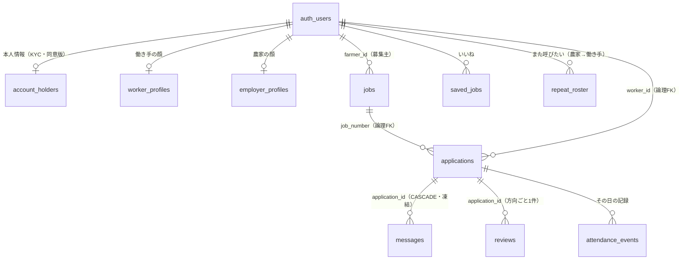
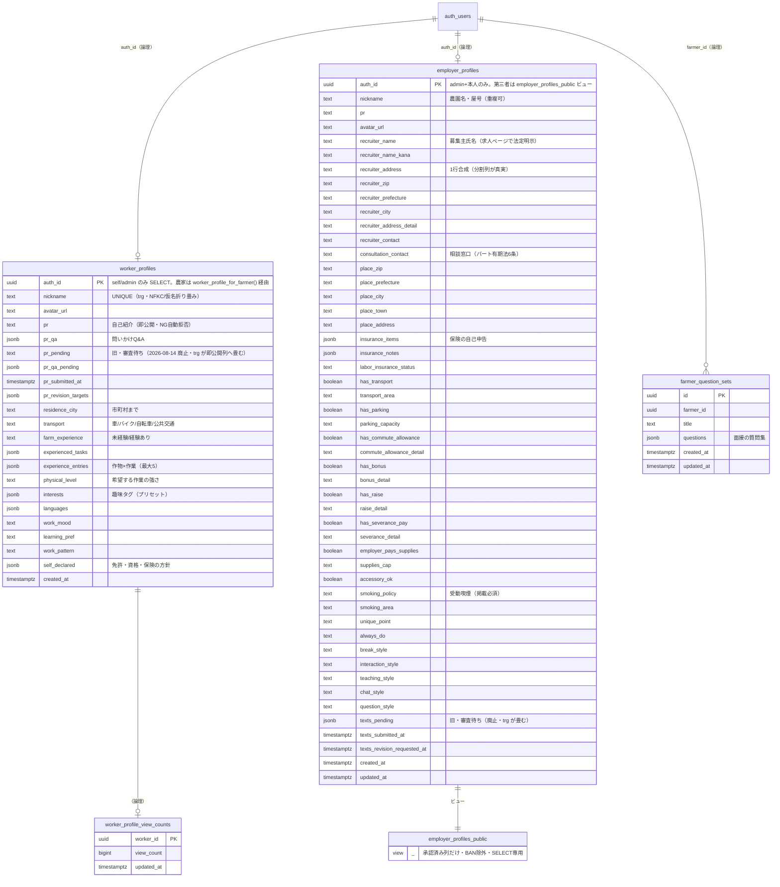
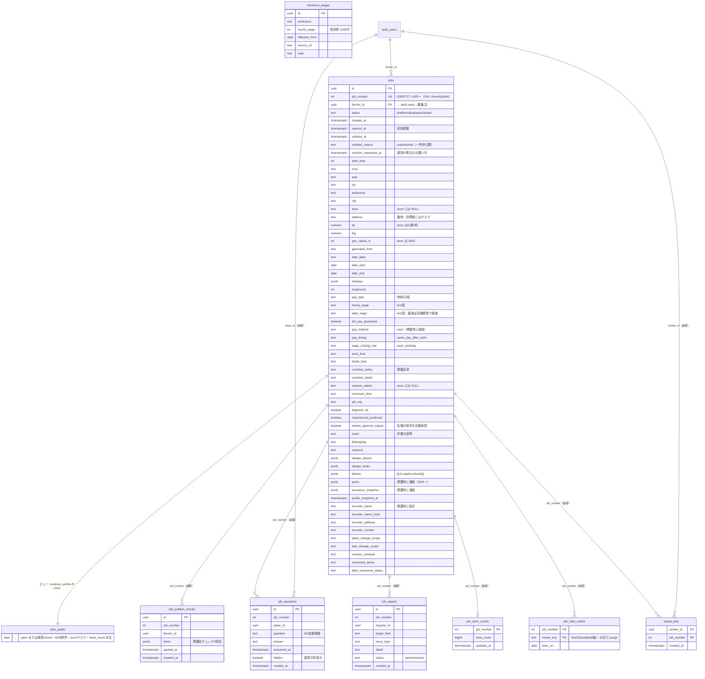
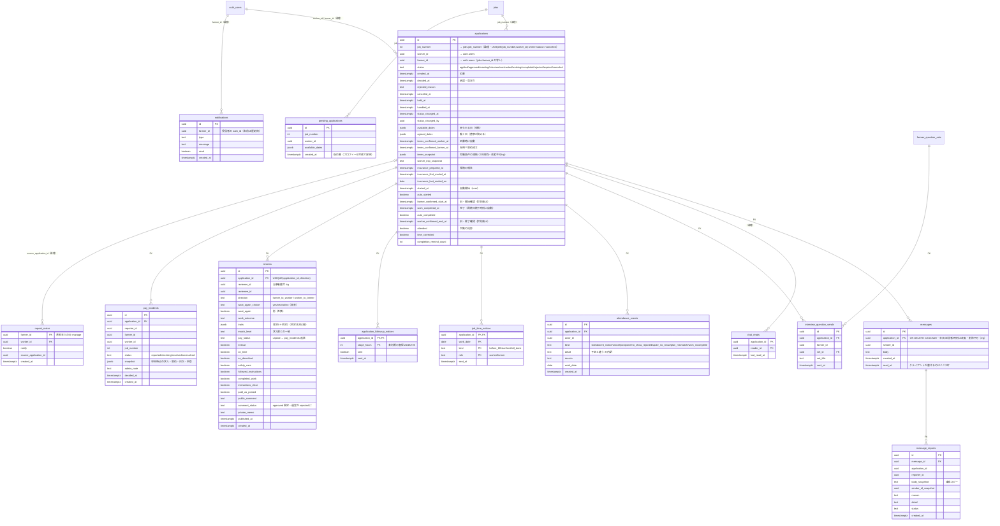
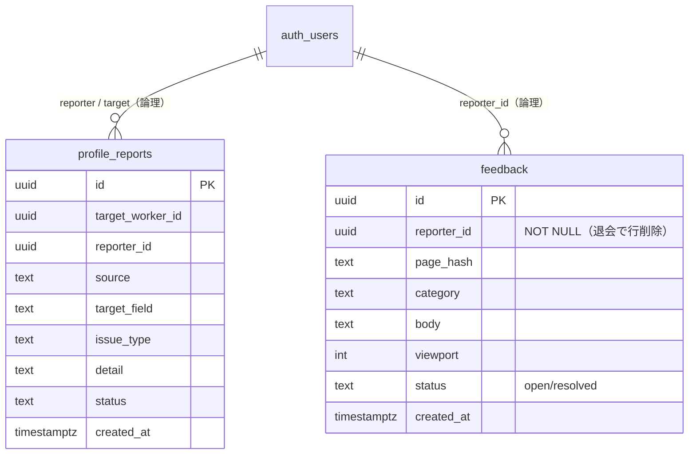
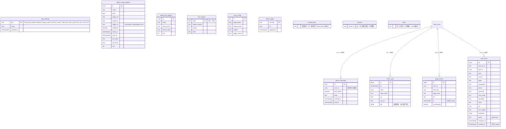
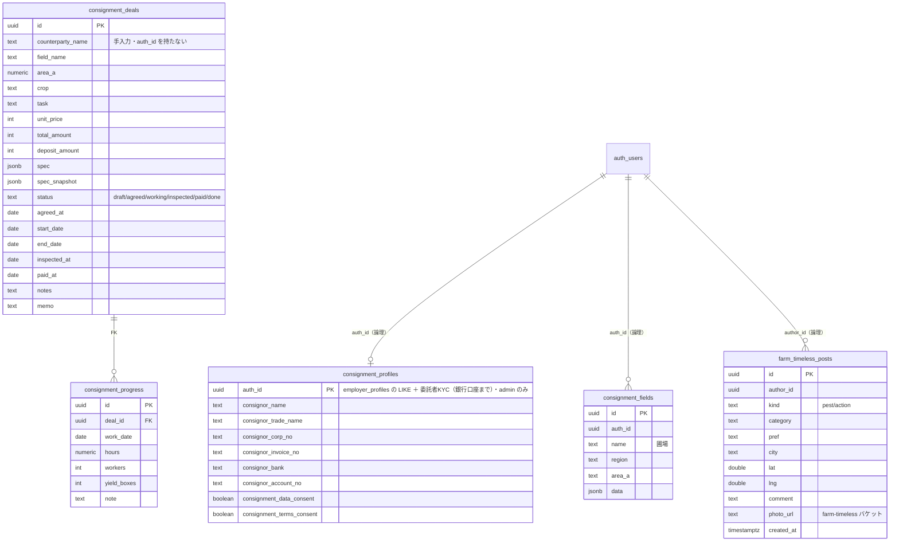

# chitose-bank ER図（Airbnb型マッチングのデータ構造）

作成日：2026-09-21　出どころ：リポジトリの最新コード（`supabase/migrations/` 437本＋`src/` の参照）

## 読み方・前提

- **正本はコード**。migrations の `create table` / `alter table` / `references` と、フロントの `.from()` `.select()` `.insert()`、RPC本文の列参照から機械抽出した。
- **基底テーブル7つは migrations に `create table` が無い**（2026-06〜07にダッシュボードで直接作成された世代）：`jobs` `applications` `messages` `worker_profiles` `farmers` `notifications` `pending_applications` `chat_reads` `app_errors` `help_images` `market_stats` `records` `dests`。これらの基底列は、ビュー定義（`jobs_public`）・RPC本文・フロントの insert/select から復元した。**列の型と NOT NULL は推定**（列名は実コードに現れるもののみ）。
- 本番DB（`aegwepgtmwcnwzybpgsh`）への照合は、作成時にDBが応答しなかった（接続タイムアウト4回）ため**未実施**。次にDBが温まった時に `information_schema.columns` と突き合わせること。
- 線の種類：`||--o{` などの実線は **DB上の外部キー（`references`）**。`}o..o{` などの点線は **FK制約が無く、RPC・RLS・アプリの規約で結んでいる論理的な関係**（例：`applications.job_number → jobs.job_number` はFK無し）。
- `auth_users` は Supabase Auth の `auth.users`。本人の識別子（`auth.uid()`）はここが唯一の源。

---

## 1. 全体像（核の11エンティティ）

Airbnb対応：ホスト＝農家（employer_profiles）／ゲスト＝働き手（worker_profiles）／リスティング＝jobs／予約リクエスト＝applications／メッセージ＝messages／レビュー＝reviews。

---

## 2. アカウント・本人情報（auth の周り）

```mermaid
erDiagram
  auth_users {
    uuid id PK
    text email "他利用者に一切出ない"
    timestamptz banned_until "退会・追放で infinity"
  }
  account_holders {
    uuid id PK
    uuid auth_id FK "UNIQUE・self-only RLS"
    text full_name "契約成立後の相手方にだけ開示"
    text postal_code
    text address
    date birth_date "18歳未満は登録不可（trg）"
    text entity_type "individual/corporate"
    text contact_email
    text contact_phone "どちらか必須（CHECK）"
    text company_name
    text company_number
    text agreed_terms_version
    text agreed_privacy_version "app_settings.privacy_version と照合"
    timestamptz agreed_at
    timestamptz created_at
    timestamptz updated_at
  }
  account_holder_changes {
    bigint id PK
    uuid account_auth_id
    timestamptz changed_at
    uuid changed_by
    text source
    jsonb old_values
    jsonb new_values
  }
  account_allowlist {
    text email PK "招待制の名簿（signup_open=true で不要）"
    text label
    timestamptz added_at
  }
  account_moderation {
    uuid auth_id PK, FK
    text state "active/suspended/banned"
    text reason
    uuid moderated_by
    timestamptz created_at
    timestamptz updated_at
  }
  app_admins {
    uuid auth_id PK, FK "運営（自己募集判定・管理RPC権限）"
    text label
    timestamptz created_at
  }
  emergency_contacts {
    uuid auth_id PK, FK "self-only・開示は contract_emergency_contact() のみ"
    text name
    text relation "本人 or 家族など"
    text phone
    timestamptz confirmed_at "第三者の連絡先は本人確認が要る"
    timestamptz updated_at
  }
  withdrawal_requests {
    uuid id PK
    uuid auth_id FK
    timestamptz requested_at
    timestamptz processed_at "process_withdrawal() が刻む"
  }
  policy_update_notices {
    uuid auth_id FK
    text doc "terms/privacy"
    text version
    timestamptz sent_at
    bigint request_id
  }
  user_onboarding_survey {
    uuid auth_id PK
    text source
    text source_other
    jsonb reasons
    text reason_other
    timestamptz created_at
  }
  push_subscriptions {
    text endpoint PK
    uuid auth_id FK
    text p256dh
    text auth
    timestamptz created_at
  }
  farmers {
    uuid id PK "旧・農家登録（AdminTab承認と RLS の農家判定に残る）"
    uuid auth_id
    text email
    text name
    text prefecture
    text municipality
    text status "pending/approved（DB既定 pending）"
    int joined_year
    text farming_type
    text experience_tier
    jsonb planned_crops
    jsonb sales_channels
    numeric area_tan
    text avatar_url
  }

  auth_users ||--o| account_holders : "FK"
  account_holders ||--o{ account_holder_changes : "account_auth_id（論理）"
  auth_users ||--o| account_moderation : "FK"
  auth_users ||--o| app_admins : "FK"
  auth_users ||--o| emergency_contacts : "FK"
  auth_users ||--o{ withdrawal_requests : "FK"
  auth_users ||--o{ policy_update_notices : "FK"
  auth_users ||--o| user_onboarding_survey : "（論理）"
  auth_users ||--o{ push_subscriptions : "FK"
  auth_users ||--o| farmers : "auth_id（論理）"
```

---

## 3. プロフィール（ホスト／ゲストの看板）

---

## 4. 求人（リスティング）

---

## 5. 応募〜契約〜評価（予約リクエストの一生）

---

## 6. 通報・意見（当事者のいない記録）

---

## 7. 運営・システム（利用者に見えない裏方）

---

## 8. 委託レーン・農タイムレス（管理者専用・別プロジェクト）

---

## 9. 補足

### ストレージ（テーブルではないが図の一部）
| バケット | 中身 | 書き込み | 参照する列 |
|---|---|---|---|
| `job-photos` | 求人・危険箇所の写真とサムネ | 本人フォルダ `{uid}/`＋admin | `jobs.photos` `jobs.danger_*` |
| `avatars` | アイコン | 本人フォルダ | `worker_profiles.avatar_url` `employer_profiles.avatar_url` |
| `help-images` | ヘルプの画像 | admin | `help_images.url` |
| `consignment-photos` | 委託の写真 | admin | `consignment_deals.spec` |
| `farm-timeless` | 農タイムレスの写真 | admin | `farm_timeless_posts.photo_url` |

### 「論理FK」のまま残っている主な関係（FK制約が無い）
- `applications.job_number → jobs.job_number`（apply_to_job / RLS / ビューが結ぶ）
- `applications.worker_id / farmer_id → auth.users.id`
- `saved_jobs` `repeat_roster` `job_questions` `job_reports` `job_publish_checks` `job_view_*` の `job_number` / `*_id`
- `worker_profiles.auth_id` `employer_profiles.auth_id`（PK だが `references auth.users` は無い）

FK制約を足すかは別判断（退会処理は `auth.users` の行を残して匿名化する設計なので、`ON DELETE CASCADE` を安易に足すと証跡が巻き添えになる）。

### 削除済み（図に載せない）
`workers`（→ worker_profiles に統合）／`attendance_corrections`・`time_corrections`（打刻の全廃）／`calendar_notes` `error_logs` `mail_failures`（2026-07-29 大掃除）／ビュー `public_summary` `monthly_pnl` `board_*`（公開ボード廃止）。

### 次にやること
1. DBが応答する時間帯に `select table_name, column_name, data_type from information_schema.columns where table_schema='public'` を取り、基底7テーブルの推定列（型・NOT NULL）を確定して本書を直す。
2. 列を足す・表を足すたびに本書を更新する（migration と同じ push に含める）。
