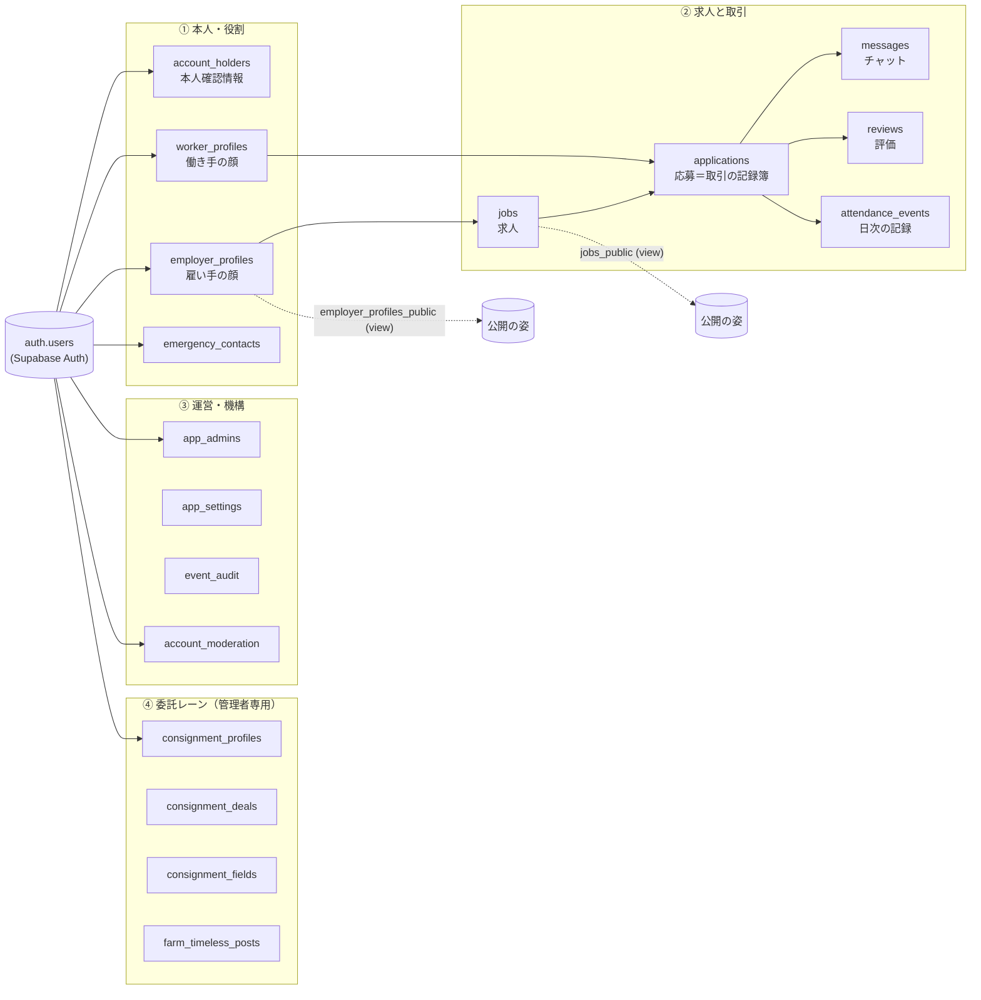
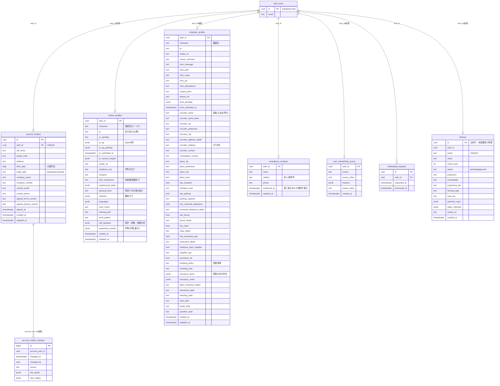
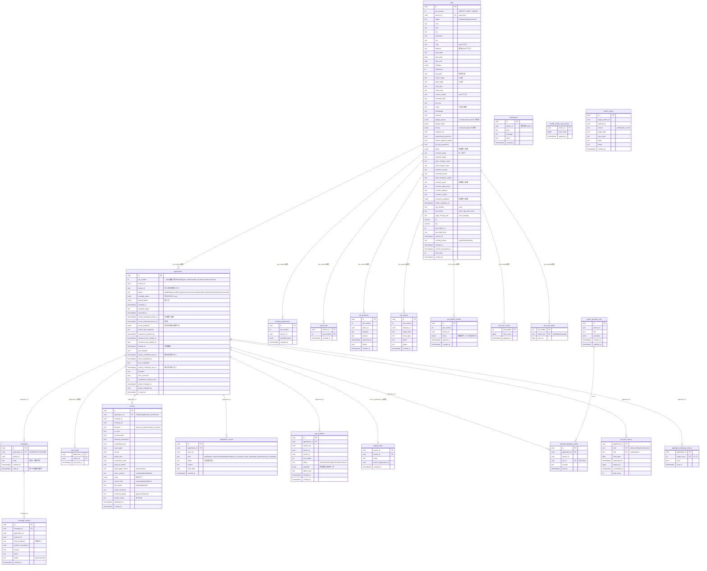
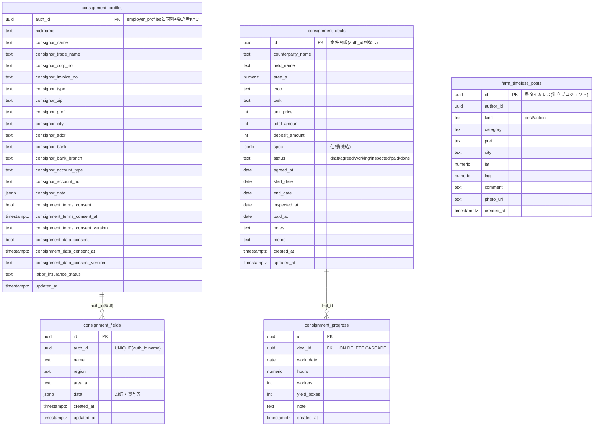

# chitose-bank ER図（2026-09-21時点）

出どころ＝リポジトリの現物（`supabase/migrations/` 437本・RPC/ビューの定義・フロントの列参照）を
main の最新コミット（6134e1c）で洗い出したもの。テーブル名・列名は migration と
`update_my_open_job` / `worker_profile_for_farmer` / `jobs_public` 等の列挙から取った。

★注意：`jobs` / `applications` / `messages` / `farmers` / `worker_profiles` / `notifications` /
`chat_reads` / `pending_applications` は migration 以前に本番へ直接作られた表（`create table` が
repo に無い）。その列は「後から足した migration」と「RPC・フロントが読み書きしている列」から
復元しているため、**型は推定を含む**。本番の `information_schema` と突き合わせる時は
`supabase/checks/audit.sql` と同じ要領で読み取り専用に照合すること（作成日はDBが応答せず未照合）。

凡例：`PK`＝主キー／`FK`＝DBの外部キー制約あり／**（論理）**＝制約は無いが値で結ぶ関係
（`job_number` → `jobs.job_number`、`auth_id` / `*_id` → `auth.users.id`）。
Mermaid は GitHub 上でそのまま描画される。

---

## 0. 全体の骨（ドメインの地図）

---

## 1. 本人・役割（アカウント層）

---

## 2. 求人と取引（マッチングの本体）

---

## 3. 運営・機構（管理者専用・ログ・設定）

```mermaid
erDiagram
  app_admins {
    uuid auth_id PK "FK auth.users"
    text label
    timestamptz created_at
  }
  app_settings {
    text key PK "signup_open / third_party_publish_allowed / privacy_version / mail_skip_when_push / apply_profile_gate / job_view_mark_salt"
    text value
    timestamptz updated_at
  }
  account_allowlist {
    text email PK
    text label
    timestamptz added_at
  }
  account_moderation {
    uuid auth_id PK "FK auth.users"
    text state "active/suspended/banned"
    text reason
    uuid moderated_by
    timestamptz created_at
    timestamptz updated_at
  }
  admin_messages {
    uuid id PK "運営DM"
    uuid user_id
    bool from_admin
    text body
    timestamptz created_at
    timestamptz read_at
  }
  admin_notice_registry {
    uuid id PK "お知らせ台帳"
    text name
    text body
    text audience
    text trigger_on "startup/after_login/login/confirm"
    bool published
    text link_hash
    text image_url
    bool show_every_time
    int repeat_chance
    int sort
    timestamptz created_at
  }
  admin_box_registry {
    uuid id PK
    text name
    text where_from
    text preview_key
    int sort
    timestamptz created_at
  }
  mail_registry {
    text code PK "M01〜"
    text subject_pattern
    int priority
    text label
  }
  minimum_wages {
    uuid id PK
    text prefecture "UNIQUE(prefecture,effective_from)"
    int hourly_wage
    date effective_from
    text source_url
    text note
  }
  push_subscriptions {
    text endpoint PK
    uuid auth_id FK
    text p256dh
    text auth
    timestamptz created_at
  }
  push_config {
    int id PK
    text vapid_public
    text vapid_private
    text subject
    text trigger_secret
  }
  policy_update_notices {
    uuid auth_id PK "FK auth.users"
    text doc PK "privacy/terms"
    text version PK
    timestamptz sent_at
    bigint request_id
  }
  feedback {
    uuid id PK
    uuid reporter_id
    text page_hash
    text category
    text body
    int viewport
    text status "open/resolved"
    timestamptz created_at
  }
  page_events {
    bigint id PK "30日で削除"
    uuid auth_id
    uuid anon_key
    text page_hash
    text src
    timestamptz ts
    bool summarized
  }
  app_errors {
    uuid id PK "1年で削除"
    text level
    text source
    text component
    text action
    text operation
    text error_code
    text message
    text stack
    text page
    text url
    text user_agent
    uuid user_id
    text session_id
    text status "open/fixed"
    timestamptz resolved_at
    timestamptz created_at
  }
  event_audit {
    bigint id PK "変更の記録(firehose)"
    timestamptz at
    uuid actor
    text table_name
    text op
    text row_pk
    jsonb diff
  }
  help_images {
    text slot_key PK
    text url
    timestamptz updated_at
  }
```

---

## 4. 委託レーン（管理者専用・利用者からは到達不可）

---

## 5. ビュー・ストレージ・旧遺物

| 種類 | 名前 | 中身 |
|---|---|---|
| view | `jobs_public` | `jobs ⨝ employer_profiles`。open（＋満員のclosed）・非公開でない・停止中でない農家の求人だけ。anon には town/番地/駅/募集主をNULL・座標2桁・半径3000m。`masked_fields` で伏せた項目名だけ返す。SELECT専用 |
| view | `employer_profiles_public` | 雇い手の看板（承認済み列のみ・BAN除外）。SELECT専用 |
| storage | `avatars` | アイコン（本人フォルダ `{uid}/`） |
| storage | `job-photos` | 求人写真・危険箇所写真・サムネ（書き込みは `{uid}/` 配下＋管理者） |
| storage | `consignment-photos` | 委託レーンの写真（書き込みは管理者） |
| storage | `farm-timeless` | 農タイムレスの写真（書き込みは管理者） |
| storage | `help-images` | ヘルプの画像（管理者） |
| legacy | `farmers` | 旧・農家登録（管理タブの承認機能とセッション復元が読む） |
| legacy | `records` / `dests` / `market_stats` | 旧・公開ボード/データ入力の残骸（UIは2026-07-24に削除・行は残置） |
| legacy | `auth_logs` | 参照ゼロ・0行（次の掃除の候補） |

---

## 6. 関係の要点（読む人向けの補足）

- **auth.users が根**。役割はアカウント属性ではなく「どのプロフィール行を持つか」で決まる
  （`worker_profiles` あり＝働き手、`employer_profiles` あり＝雇い手。両方持てる）。
- **applications が取引の記録簿**。状態を上書きせず時刻列を追記する（`terms_confirmed_*_at`・
  `started_at`・`work_completed_at`…）。段階ラベルは `app_phase()` が導出し、列としては持たない。
- **契約の凍結**＝`applications.terms_snapshot`（採用時）と `jobs.perks / insurance_snapshot /
  recruiter_* / pay_*`（掲載時）。どちらもトリガーで改変を拒む。
- **DBの外部キーは応募まわりに集中**（`messages` / `reviews` / `attendance_events` / `pay_incidents` /
  `interview_question_sends` / `job_time_notices` / `application_followup_notices` → `applications.id`）。
  `job_number` で結ぶ表（`saved_jobs` / `job_questions` / `job_reports` / `job_view_*` /
  `pending_applications` / `applications`）は制約なしの論理関係。
- **証跡は消さない**：`messages` は本文・送信者・時刻の改変と削除を全経路で拒否。
  `jobs` は掲載済み・応募あり・作業日経過の行を DELETE できない。退会（`process_withdrawal`）は
  本人の届出情報を消し、取引の記録は匿名化して残す。
- **期限つきの掃除**：`page_events` 30日・`app_errors` 1年・`job_view_marks` 30日（cron）。
  チャット・契約・通報・`event_audit` の3年削除は未実装（2028年内に設計）。
